# Diagramas del Sistema

## 🏗️ Diagrama de Casos de Uso

Este diagrama ilustra las interacciones principales entre los usuarios (Clientes y Administradores) y el sistema.

```mermaid
usecaseDiagram
    actor "Cliente (Invitado/Registrado)" as User
    actor "Administrador" as Admin

    package "Sistema E-commerce" {
        usecase "Registrarse / Iniciar Sesión" as UC1
        usecase "Explorar Catálogo" as UC2
        usecase "Buscar Productos" as UC3
        usecase "Ver Detalles de Producto" as UC4
        usecase "Gestionar Carrito" as UC5
        usecase "Recibir Recomendaciones IA" as UC6
        usecase "Consultar Chatbot AI" as UC7
        usecase "Realizar Compra (Checkout)" as UC8
        
        usecase "Gestionar Productos" as UC9
        usecase "Gestionar Usuarios" as UC10
        usecase "Ver Métricas (Dashboard)" as UC11
    }

    User --> UC1
    User --> UC2
    User --> UC3
    User --> UC4
    User --> UC5
    User --> UC6
    User --> UC7
    User --> UC8

    Admin --> UC1
    Admin --> UC9
    Admin --> UC10
    Admin --> UC11
    
    %% Relaciones adicionales
    UC5 ..> UC6 : <<include>>
    UC8 ..> UC7 : <<extend>>
```

## 🔄 Diagrama de Flujo de Usuario (Happy Path)

Este diagrama muestra el recorrido típico de un usuario desde que entra al sitio hasta que completa una compra.

```mermaid
graph TD
    A[Inicio] --> B{¿Está Logueado?}
    B -- No --> C[Página de Login/Registro]
    B -- Sí --> D[Catálogo de Productos]
    
    C --> |Registro Exitoso| D
    
    subgraph "Exploración y Compra"
        D --> E[Ver Detalle Producto]
        E --> F[Agregar al Carrito]
        F --> G[Ver Carrito]
        
        G --> H{¿El usuario duda?}
        H -- Sí --> I[Chatbot AI: Asistencia y Ofertas]
        I --> G
        H -- No --> J[Proceder al Checkout]
        
        G --> |IA Detecta Interés| K[Recomendaciones Cross-Selling]
        K --> F
    end
    
    J --> L[Confirmar Datos y Pago]
    L --> M[Compra Exitosa]
    M --> N[Fin]
```


