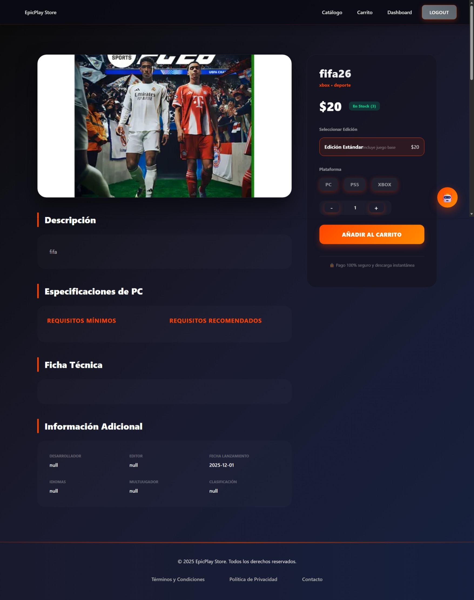
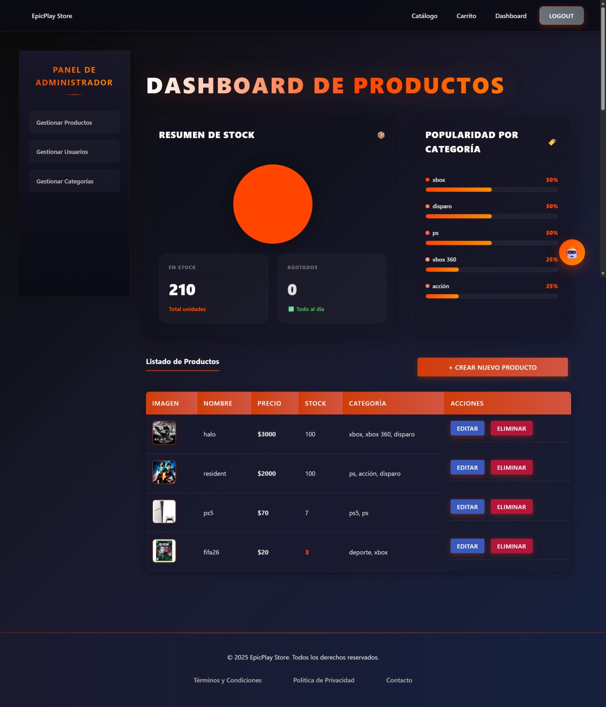
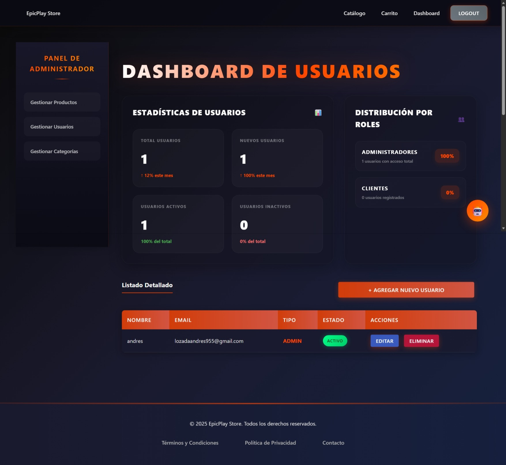
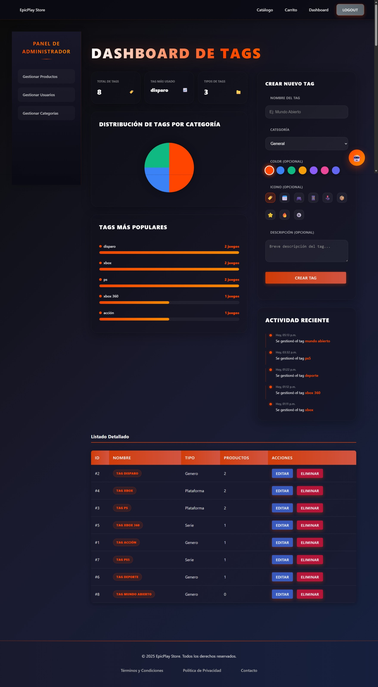
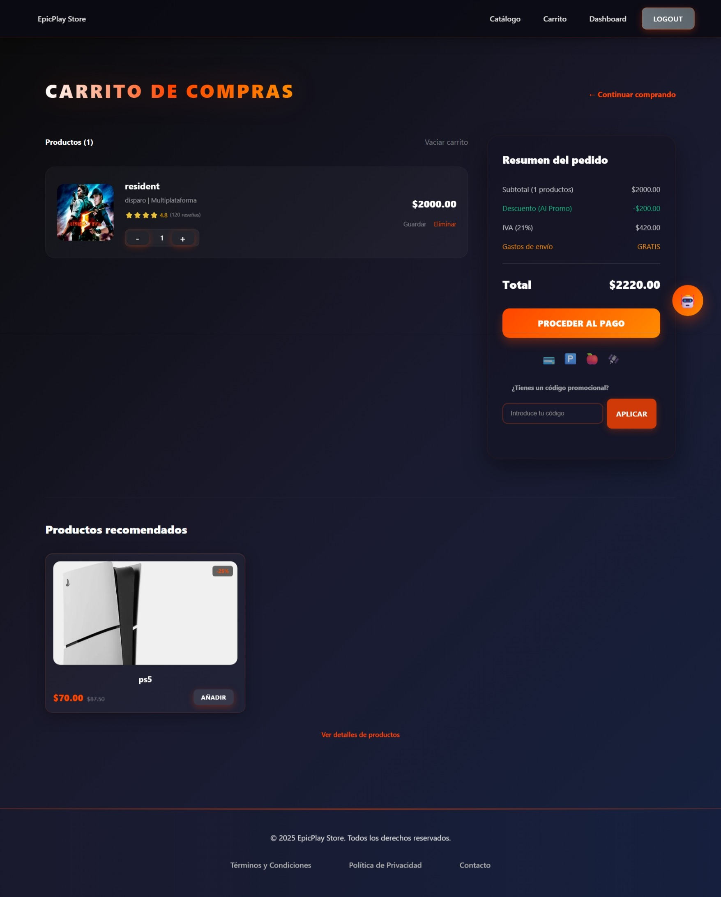
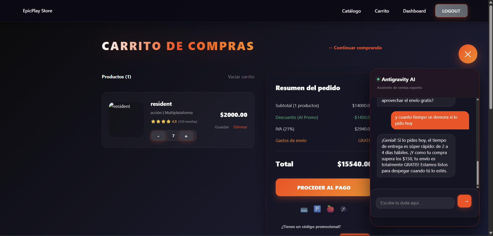
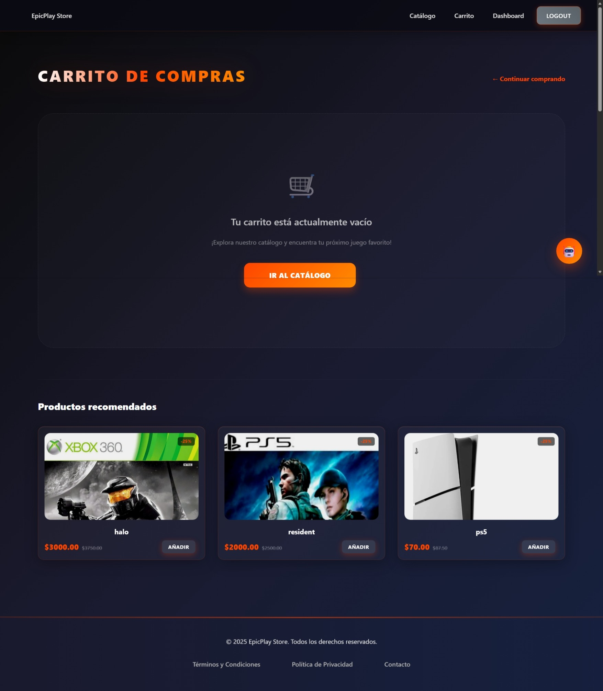

# E-commerce Game V.3 🎮

Bienvenido a la versión 3 de E-commerce Game, una plataforma moderna full-stack para la venta de videojuegos y hardware. Esta versión incluye un sistema de administración avanzado, integración con IA para recomendaciones, y una interfaz de usuario premium.

## 🚀 Características Principales

*   **Catálogo Interactivo**: Filtrado por categorías, búsqueda avanzada y vista detallada.
*   **Gestión de Usuarios**: Roles de administrador y cliente, con autenticación segura (JWT).
*   **Dashboard Administrativo**: Gráficos y estadísticas para gestionar Productos, Usuarios y Tags/Categorías.
*   **Inteligencia Artificial**: Chatbot integrado y recomendaciones personalizadas en el carrito.
*   **Carrito de Compras**: Gestión de pedidos en tiempo real.

## 📸 Galería de Imágenes

### Vista Principal y Catálogo
Explora nuestra amplia colección de juegos.


### Detalle de Producto
Información exhaustiva, especificaciones técnicas y requisitos del sistema.


### Panel de Administración (Dashboard)
Gestión total del sistema con métricas visuales.

**Gestión de Productos**
Control de stock y estadísticas de inventario.


**Gestión de Usuarios**
Administración de cuentas y roles.


**Gestión de Categorías (Tags)**
Organización visual de etiquetas.


### Funcionalidades AI y Carrito
**Carrito con Recomendaciones AI**
Sugerencias inteligentes basadas en tu selección.


**Asistente Virtual (Chat AI)**
Resuelve tus dudas al instante.


**Estado del Carrito**
Feedback visual intuitivo.


---

## 🛠️ Estructura del Proyecto

El proyecto se divide en dos partes principales:

-   `frontend/`: Aplicación React + Vite.
-   `backend/`: API REST con Node.js, Express y PostgreSQL.

## 🏁 Cómo Empezar

### Prerrequisitos

-   Node.js
-   npm
-   PostgreSQL

### Configuración del Backend

1.  Navega al directorio `backend`:
    ```bash
    cd backend
    ```
2.  Instala las dependencias:
    ```bash
    npm install
    ```
3.  Crea un archivo `.env` configurando tu base de datos y `JWT_SECRET`.
4.  Inicia el servidor:
    ```bash
    npm start
    ```

### Configuración del Frontend

1.  Navega al directorio `frontend`:
    ```bash
    cd frontend
    ```
2.  Instala las dependencias:
    ```bash
    npm install
    ```
3.  Inicia el servidor de desarrollo:
    ```bash
    npm run dev
    ```

¡Disfruta del desarrollo! 🚀
