# E-commerce Game V.3 🎮

Bienvenido a la versión 3 de E-commerce Game, una plataforma moderna full-stack para la venta de videojuegos y hardware. Esta versión incluye un sistema de administración avanzado, integración con IA para recomendaciones, y una interfaz de usuario premium.

## 🚀 Características Principales

*   **Catálogo Interactivo**: Filtrado por categorías, búsqueda avanzada y vista detallada.
*   **Gestión de Usuarios**: Roles de administrador y cliente, con autenticación segura (JWT).
*   **Dashboard Administrativo**: Gráficos y estadísticas para gestionar Productos, Usuarios y Tags/Categorías.
*   **Inteligencia Artificial**: Chatbot integrado y recomendaciones personalizadas en el carrito.
*   **Carrito de Compras**: Gestión de pedidos en tiempo real.

## 🤖 Integración de Inteligencia Artificial

### IA para detectar abandono en tiempo real
*   El sistema identifica señales como inactividad (>1–2 min) o dudas en el carrito.
*   Actúa antes de que el usuario abandone.

### Recomendaciones personalizadas con IA
*   Upselling y cross-selling dinámico según el comportamiento del usuario.
*   Ejemplo: sugerir productos complementarios o descuentos relevantes.

### Chatbot predictivo integrado al checkout
*   Resuelve dudas frecuentes (precio, talla, envío) sin salir del flujo.
*   Reduce fricción y pasos innecesarios.

### Optimización del checkout
*   Pasar de un proceso largo (>5 min) a checkout en un solo paso.
*   IA acompaña la decisión final de compra.

## 📸 Galería de Imágenes

### Vista Principal y Catálogo
Explora nuestra amplia colección de juegos.


### Detalle de Producto
Información exhaustiva, especificaciones técnicas y requisitos del sistema.


### Panel de Administración (Dashboard)
Gestión total del sistema con métricas visuales.

**Gestión de Productos**
Control de stock y estadísticas de inventario.


**Gestión de Usuarios**
Administración de cuentas y roles.


**Gestión de Categorías (Tags)**
Organización visual de etiquetas.


### Funcionalidades AI y Carrito
**Carrito con Recomendaciones AI**
Sugerencias inteligentes basadas en tu selección.


**Asistente Virtual (Chat AI)**
Resuelve tus dudas al instante.


**Estado del Carrito**
Feedback visual intuitivo.


---

---

## 📐 Diagramas de Arquitectura

### Diagrama de Casos de Uso
Interacciones principales entre usuarios y el sistema.
```mermaid
usecaseDiagram
    actor "Cliente" as User
    actor "Administrador" as Admin

    package "E-commerce Game V.3" {
        usecase "Registrarse / Login" as UC1
        usecase "Ver Catálogo" as UC2
        usecase "Carrito + IA Recomendaciones" as UC5
        usecase "Chatbot AI" as UC7
        usecase "Checkout" as UC8
        
        usecase "Gestión (Productos/Users)" as UC9
        usecase "Ver Dashboard" as UC11
    }

    User --> UC1
    User --> UC2
    User --> UC5
    User --> UC7
    User --> UC8

    Admin --> UC1
    Admin --> UC9
    Admin --> UC11
```

### Diagrama de Flujo de Usuario
Recorrido típico de compra con asistencia de IA.

```mermaid
graph TD
    A[Inicio] --> B{¿Login?}
    B -- No --> C[Login/Registro]
    B -- Sí --> D[Catálogo]
    C --> D
    
    D --> E[Detalle Producto]
    E --> F[Agregar al Carrito]
    
    F --> G{¿Dudas?}
    G -- Sí --> H[Chatbot AI]
    H --> F
    G -- No --> I[Checkout]
    
    subgraph "Inteligencia Artificial"
    F -.-> |Sugerencias| J[Cross-Selling]
    J --> F
    end
    
    I --> K[Compra Exitosa]
```


## 🛠️ Estructura del Proyecto

El proyecto se divide en dos partes principales:

-   `frontend/`: Aplicación React + Vite.
-   `backend/`: API REST con Node.js, Express y PostgreSQL.

## 🏁 Cómo Empezar

### Prerrequisitos

-   Node.js
-   npm
-   PostgreSQL

### Configuración del Backend

1.  Navega al directorio `backend`:
    ```bash
    cd backend
    ```
2.  Instala las dependencias:
    ```bash
    npm install
    ```
3.  Crea un archivo `.env` configurando tu base de datos y `JWT_SECRET`.
4.  Inicia el servidor:
    ```bash
    npm start
    ```

### Configuración del Frontend

1.  Navega al directorio `frontend`:
    ```bash
    cd frontend
    ```
2.  Instala las dependencias:
    ```bash
    npm install
    ```
3.  Inicia el servidor de desarrollo:
    ```bash
    npm run dev
    ```

¡Disfruta del desarrollo! 🚀
